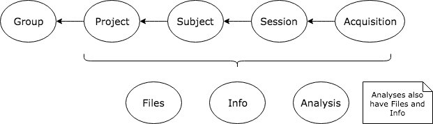

Data in a Flywheel system is organized in a tree-like hierarchy, as indicated in the following diagram.

-   [`flywheel.models.user.User`](flywheel.models.html#flywheel.models.user.User "flywheel.models.user.User") - An authorized entity, usually referenced by email address.

-   [`flywheel.models.group.Group`](flywheel.models.html#flywheel.models.group.Group "flywheel.models.group.Group") - A grouping of users and projects.

-   [`flywheel.models.project.Project`](flywheel.models.html#flywheel.models.project.Project "flywheel.models.project.Project") - A project represents a grouping of subjects and sessions, e.g. within a study.

-   [`flywheel.models.subject.Subject`](flywheel.models.html#flywheel.models.subject.Subject "flywheel.models.subject.Subject") - An individual under study.

-   [`flywheel.models.session.Session`](flywheel.models.html#flywheel.models.session.Session "flywheel.models.session.Session") - A grouping of acquired data, typically data acquired within a limited timeframe.

-   [`flywheel.models.acquisition.Acquisition`](flywheel.models.html#flywheel.models.acquisition.Acquisition "flywheel.models.acquisition.Acquisition") - A set of one or more files, typically acquired as part of the same process, at the same time.

-   [`flywheel.models.analysis_output.AnalysisOutput`](flywheel.models.html#flywheel.models.analysis_output.AnalysisOutput "flywheel.models.analysis_output.AnalysisOutput") - A set of one or more derivative files from analyzing files after they have been acquired.

